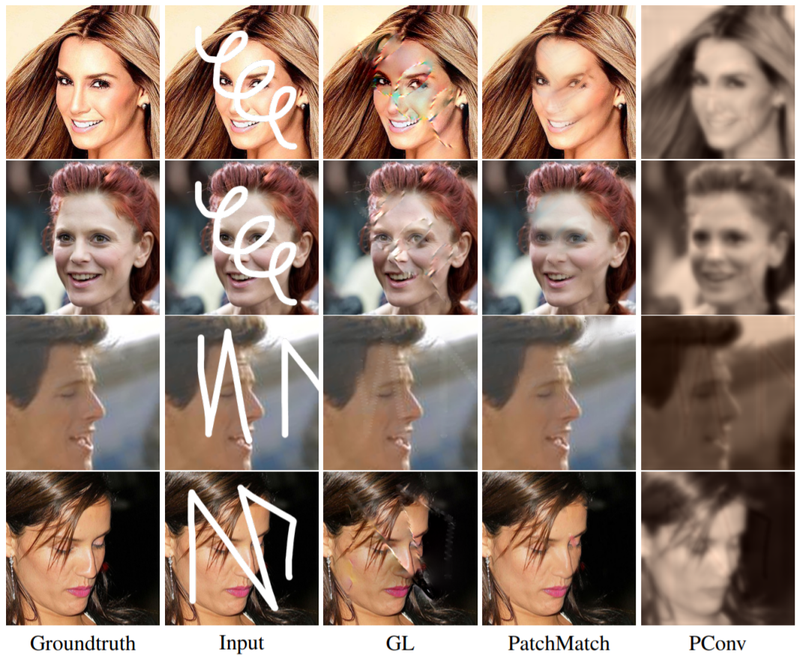
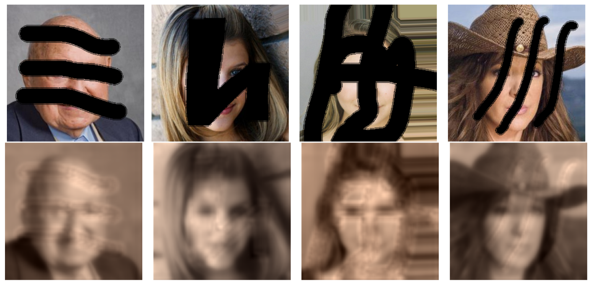

# Image reconstruction

## Download the Large-scale CelebFaces Attributes (CelebA) Dataset from their Google Drive link.

CelebA: http://mmlab.ie.cuhk.edu.hk/projects/CelebA.html
Google Drive: https://drive.google.com/drive/folders/0B7EVK8r0v71pWEZsZE9oNnFzTm8

python3 get_drive_file.py 0B7EVK8r0v71pZjFTYXZWM3FlRnM celebA.zip

## Model :

Programming Part folder : 
train.py -> train the model and save checkpoints and evolution of the losses on the training and validation sets.
test.py -> call a checkpoint of the model and compute the reconstruction on a test set and the accuracy of the reconstruction according to the 3 metrics : L1, PSNR and MSSSIM.

## Results :

